# SaraivaOS — Plano de alinhamento total da musicacom.ia

Data: 29 de julho de 2026  
Modo: blueprint — nenhuma mudança de produto ou publicação foi executada  
Objetivo: substituir a aquisição baseada em música completa grátis por uma
prévia criativa grátis e uma oferta inicial paga, deixando promessa, produto,
checkout, créditos, termos, atendimento, métricas e campanha consistentes.

## Decisão executiva

Adotar uma única oferta pública:

> **Projeto Música Presente — R$ 49,97, pagamento único via Pix.**
>
> O visitante monta gratuitamente a história, a letra preliminar, o clima e a
> direção musical. O pagamento libera 20 créditos musicais, equivalentes a 10
> rodadas pagas, com até 2 versões por rodada.

Não anunciar enquanto a jornada pública ainda prometer música completa grátis
ou apresentar “20 músicas” como se fossem 20 rodadas.

## 1. Sinais

### Observados

- A home ativa promete “duas músicas” e “1 música grátis por dia”.
- O cadastro promete “comece sem pagar” e “1 grátis todo dia”.
- `/checkout/` apresenta R$ 0 e leva ao cadastro grátis.
- Existe um componente de checkout pago a R$ 49,97, mas ele não está conectado
  à rota pública.
- A tela de créditos vende “20 músicas” por R$ 49,97.
- O backend concede 20 créditos e reserva 2 créditos por rodada paga.
- A página de termos garante uma música gratuita por dia.
- A telemetria já possui eventos de landing, checkout, Pix, compra e ativação.
- O projeto já possui Woovi, webhooks idempotentes, Cognito, biblioteca, player,
  capa, download e relatório de funil.
- O gêmeo digital ainda acompanha experimentos baseados na rota gratuita.

### Fornecidos

- O orçamento inicial de mídia será R$ 500.
- A música completa grátis deve ser retirada.
- O usuário quer uma estratégia comercial mais agressiva.
- O pacote de R$ 49,97 precisa ser explicado corretamente.

### Inferidos

- Comprar tráfego antes da correção faria o anúncio levar para uma oferta
  diferente da prometida.
- “20 músicas” pode ser entendido como 20 criações, enquanto o sistema entrega
  10 rodadas pagas.
- Uma prévia textual e criativa preserva demonstração de valor sem entregar o
  produto completo antes do pagamento.

### Desconhecidos a medir

- Taxa de pessoas que concluem a prévia.
- Taxa de prévia concluída para checkout.
- Taxa de Pix criado para Pix pago.
- Custo real por compra com a oferta emocional.
- Percentual de gerações que entrega uma ou duas versões válidas.
- Impacto da retirada do benefício diário sobre usuários existentes.

## 2. Assimetria

A musicacom.ia já possui o ativo difícil: geração, pagamento, liberação de
créditos, biblioteca, capa, download e instrumentação.

O gargalo dominante não é falta de produto. É a ausência de um contrato
comercial único entre:

```text
anúncio → landing → prévia → checkout → Pix → créditos → geração → entrega
```

A vantagem é poder corrigir a aquisição e a nomenclatura sem reconstruir o
motor musical.

## 3. Rota

### Rota principal

**Prévia criativa grátis → Pix de R$ 49,97 → 20 créditos → 10 rodadas pagas →
até 2 versões por rodada.**

### Apoio 1

Preservar toda a história e direção escolhida durante cadastro, pagamento e
entrada no criador.

### Apoio 2

Usar a telemetria existente para validar a oferta antes de liberar os R$ 500
inteiros.

### Métodos escolhidos

- SaraivaOS como sistema principal de decisão, execução e aprendizado.
- First Principles para corrigir a unidade econômica e o contrato da oferta.
- Jobs/minimalismo para reduzir a jornada ao menor número de decisões.
- Laboratório SaraivaOS para validar a campanha sem tratar mídia publicada como
  prova de mercado.

## 4. Arquitetura da oferta

### Contrato comercial canônico

| Campo | Valor |
|---|---|
| Versão | `music_present_v1` |
| Produto | Projeto Música Presente |
| ID técnico | `starter_20` |
| Preço | R$ 49,97 |
| Pagamento | Pix único |
| Saldo concedido | 20 créditos |
| Consumo | 2 créditos por rodada paga |
| Capacidade | 10 rodadas pagas |
| Entrega | até 2 versões por rodada |
| Potencial | até 20 músicas |
| Pré-pagamento | prévia criativa, sem áudio completo |
| Pós-pagamento | geração, biblioteca, player, download, capa e tutorial |

### Regra de comunicação

Usar sempre:

> 20 créditos musicais = 10 rodadas pagas, com até 2 versões por rodada.

Não usar isoladamente:

- 20 músicas;
- 20 criações;
- 10 músicas;
- duas músicas;
- R$ 2,50 por música;
- grátis, sem explicar que se trata da prévia.

### Regra de produto

1. A prévia não consome crédito.
2. Uma rodada paga reserva 2 créditos.
3. Duas versões válidas liquidam os 2 créditos.
4. Uma entrega parcial deve devolver o crédito da versão não entregue.
5. Falha total deve devolver os 2 créditos.
6. Webhook repetido não pode conceder saldo duas vezes.
7. Créditos pagos existentes não vencem nem são removidos na migração.

## 5. Nova jornada

```mermaid
flowchart LR
  A["Anúncio emocional"] --> B["Landing Projeto Música Presente"]
  B --> C["Pessoa conta a história"]
  C --> D["Prévia: título, refrão e direção"]
  D --> E["CTA: gerar versões completas por R$ 49,97"]
  E --> F["Nome + e-mail"]
  F --> G["Pix"]
  G --> H["Pagamento confirmado"]
  H --> I["Conta ativada + 20 créditos"]
  I --> J["Projeto recuperado no criador"]
  J --> K["Rodada: até 2 versões"]
  K --> L["Ouvir, baixar e criar capa"]
```



### O que a prévia entrega

- resumo da história;
- sugestão de título;
- trecho de refrão;
- emoção principal;
- direção de estilo e voz;
- resumo do que será liberado após o pagamento.

### O que a prévia não entrega

- áudio completo;
- download;
- capa final;
- biblioteca musical;
- promessa de aprovação, renda, streams ou resultado artístico.

## 6. Migração do modelo gratuito

### Novos visitantes e contas

- entram diretamente na oferta `music_present_v1`;
- podem criar a prévia sem pagamento;
- precisam pagar para gerar áudio completo;
- não recebem benefício diário.

### Contas existentes

- preservam integralmente créditos comprados;
- recebem aviso claro sobre a mudança;
- mantêm o benefício diário por uma janela de transição de 7 dias;
- após a janela, passam ao modelo de prévia grátis + créditos pagos;
- a data de encerramento deve aparecer na área logada e no suporte.

### Controle técnico

Adicionar versão de oferta ou benefício por conta, evitando depender somente de
texto ou de uma variável global:

```text
offerVersion: music_present_v1
dailyBenefitEndsAt: data da transição ou null
```

Usar uma flag de lançamento para ativar a oferta nova de forma coordenada no
frontend e no backend.

## 7. Plano de implementação

### Fase 0 — congelar a contradição

Prazo: meio dia.

Entregas:

- não iniciar a campanha;
- criar uma branch dedicada;
- registrar screenshots e métricas atuais como baseline;
- preservar as alterações já existentes no worktree;
- definir `music_present_v1` como contrato aprovado.

Critério de aceite:

- decisão registrada;
- baseline recuperável;
- nenhuma mudança publicada parcialmente.

### Fase 1 — fonte única da oferta

Prazo: 1 dia.

Arquivos centrais:

- `app/lib/musicProducts.ts`;
- `infra/checkout/index.mjs`;
- novo contrato compartilhado ou validação automática de paridade;
- `tests/pricing-contract.test.mjs`.

Mudanças:

- renomear produtos para créditos e rodadas;
- remover equivalências ambíguas por música;
- remover “Mais escolhido” sem prova;
- garantir paridade de ID, preço, créditos e copy entre frontend e backend;
- implementar liquidação proporcional em entrega parcial.

Critério de aceite:

- nenhum produto é chamado apenas de “20 músicas”;
- teste falha se frontend e backend divergirem;
- falha ou entrega parcial devolve saldo correto.

### Fase 2 — prévia criativa

Prazo: 1 dia.

Superfícies:

- landing específica do Projeto Música Presente;
- armazenamento temporário da história e direção;
- recuperação após login ou pagamento;
- limites contra abuso sem bloquear a experiência.

Mudanças:

- criar história → título → refrão → direção;
- CTA pago somente depois da prévia;
- preservar UTMs, sessão e projeto;
- não gerar música completa antes do Pix.

Critério de aceite:

- visitante conclui a prévia no mobile;
- recarregar a página não perde o projeto durante a janela definida;
- nenhuma geração de áudio ocorre sem pagamento ou saldo.

### Fase 3 — checkout pago real

Prazo: 1 dia.

Arquivos centrais:

- `app/checkout/page.tsx`;
- `app/checkout/CheckoutClient.tsx`;
- `infra/checkout/index.mjs`;
- e-mail de confirmação e ativação.

Mudanças:

- conectar `/checkout/` ao produto `starter_20`;
- mostrar R$ 49,97 e o contrato completo;
- corrigir marca antiga no WhatsApp;
- carregar resumo da história no checkout;
- manter idempotência de criação, webhook e concessão de créditos;
- recuperar pedido pendente pelo e-mail.

Critério de aceite:

- Pix real pode ser criado uma única vez por pedido;
- pagamento confirmado concede exatamente 20 créditos;
- webhook duplicado não duplica saldo;
- comprador chega ao criador com o projeto preservado.

### Fase 4 — alinhamento de todas as superfícies

Prazo: 1 dia.

Atualizar:

- home e metadata;
- login e cadastro;
- checkout;
- gerador;
- biblioteca e saldo;
- página de créditos;
- Academia/tutorial;
- FAQ;
- termos;
- reembolso;
- suporte e WhatsApp;
- e-mails;
- QG Ads;
- relatórios internos;
- testes e fixtures.

Arquivos já identificados:

- `app/components/HomePage.tsx`;
- `app/page.tsx`;
- `app/login/AccessLogin.tsx`;
- `app/checkout/page.tsx`;
- `app/checkout/CheckoutClient.tsx`;
- `app/biblioteca/gerador/page.tsx`;
- `app/biblioteca/creditos/page.tsx`;
- `app/biblioteca/page.tsx`;
- `app/academia/comecar/page.tsx`;
- `app/academia/musica/page.tsx`;
- `app/termos/page.tsx`;
- `app/lib/musicProducts.ts`;
- `infra/checkout/index.mjs`;
- `infra/funnel-report.mjs`;
- `qg-ads/app/dashboard.tsx`;
- testes de preço, produto, autenticação e E2E.

Critério de aceite:

```bash
rg -i "música grátis|20 músicas|R\\$ ?0|recargas opcionais|mais escolhido" \
  app infra qg-ads
```

O comando deve retornar apenas ocorrências explicitamente permitidas para a
transição de contas antigas.

### Fase 5 — telemetria e prova técnica

Prazo: 1 dia.

Funil novo:

1. `landing_view`;
2. `story_started`;
3. `preview_completed`;
4. `checkout_view`;
5. `checkout_started`;
6. `pix_created`;
7. `purchase_confirmed`;
8. `access_activated`;
9. `paid_generation_started`;
10. `music_generation_delivered`;
11. `music_result_played`;
12. `music_downloaded`.

Requisitos:

- preservar UTMs até a compra;
- usar `eventId` comum entre Pixel e CAPI quando houver duplicidade;
- receita deve vir do backend após pagamento confirmado;
- dashboard deve separar prévia, Pix e compra por origem e criativo;
- analytics nunca pode bloquear compra ou geração.

Critério de aceite:

- uma compra de teste aparece uma vez no funil;
- valor e moeda são corretos;
- origem e campanha sobrevivem da landing à confirmação;
- nenhum evento de compra nasce apenas no navegador.

### Fase 6 — QA e lançamento coordenado

Prazo: 1 dia.

Matriz mínima:

| Jornada | Desktop | Mobile |
|---|---:|---:|
| Anúncio/UTM → landing | ✓ | ✓ |
| História → prévia | ✓ | ✓ |
| Prévia → checkout | ✓ | ✓ |
| Pix pendente → retorno | ✓ | ✓ |
| Pix pago → 20 créditos | ✓ | ✓ |
| Primeira rodada → até 2 versões | ✓ | ✓ |
| Falha → devolução de saldo | ✓ | ✓ |
| Download e capa | ✓ | ✓ |
| Conta antiga em transição | ✓ | ✓ |

Validações:

- testes unitários e de contrato;
- build AWS;
- E2E em desktop e mobile;
- teste real controlado de Pix;
- webhook repetido;
- falha parcial e total de geração;
- screenshot antes/depois;
- domínio, API, CloudFront e Lambda;
- busca residual de copy antiga;
- verificação dos eventos no funil.

Ordem de publicação:

1. backend compatível com os dois modelos;
2. frontend novo ainda atrás da flag;
3. smoke test;
4. ativação da flag;
5. validação pública;
6. somente então campanha.

Critério de aceite final:

- zero contradição entre anúncio, página, checkout, saldo e termos;
- compra real comprovada;
- 20 créditos concedidos uma única vez;
- projeto preservado até a geração;
- métricas completas da origem à entrega.

## 8. Plano dos R$ 500

O orçamento só começa depois do aceite técnico.

### Etapa A — R$ 100: prova do sistema

- 2 criativos emocionais;
- 1 público amplo;
- mesma landing e mesma oferta;
- objetivo: provar rastreamento, prévia, Pix e compra.

### Etapa B — R$ 300: validação

- manter o melhor criativo;
- testar uma nova abertura emocional;
- mudar uma variável dominante por vez;
- objetivo: estimar custo por compra e localizar a principal queda.

### Etapa C — R$ 100: confirmação

- concentrar no melhor conjunto;
- objetivo: verificar se o desempenho se sustenta fora do primeiro lote.

### Hipóteses de decisão

Estes valores são metas de teste, não resultados garantidos:

| Métrica | Corrigir | Aceitável | Forte |
|---|---:|---:|---:|
| CTR de link | < 1,0% | 1,0%–1,5% | > 1,5% |
| CPC | > R$ 2,00 | R$ 1,00–2,00 | < R$ 1,00 |
| Landing → prévia concluída | < 15% | 15%–25% | > 25% |
| Prévia → checkout | < 5% | 5%–10% | > 10% |
| Pix criado → pago | < 25% | 25%–40% | > 40% |
| CPA | > R$ 49,97 | R$ 35–49,97 | < R$ 35 |

Com preço de R$ 49,97, são necessárias 11 compras para superar R$ 500 em
faturamento bruto. Isso não representa lucro porque custos de geração,
pagamento, impostos, suporte e infraestrutura ainda precisam ser descontados.

### Regras

- problema de clique: ajustar criativo;
- clique sem prévia: ajustar landing;
- prévia sem checkout: ajustar oferta e demonstração;
- Pix sem pagamento: ajustar confiança, instrução e recuperação;
- compra sem geração: interromper mídia e corrigir produto;
- CPA acima do preço após volume suficiente: não escalar.

## 9. O que fica fora desta primeira implantação

- assinatura Clube Criador como oferta principal;
- múltiplos pacotes na landing;
- campanhas separadas de jingle B2B;
- promessa de distribuição, streams ou renda;
- programa de indicação;
- upsells antes da primeira música entregue.

Esses elementos podem voltar depois que a oferta inicial produzir evidência.

## 10. Governança do gêmeo digital

Antes da implementação:

- preservar os experimentos antigos como históricos;
- não classificá-los como validados sem as 100 sessões previstas;
- substituir a rota atual somente após aprovação deste blueprint;
- registrar a Oferta V2 como nova rota;
- abrir um experimento próprio para `preview_completed → purchase_confirmed`;
- anexar screenshots, testes, prova de Pix e relatório de funil.

## 11. Critério de “redondinho”

O projeto só está pronto para tráfego quando todas as respostas forem “sim”:

- [ ] O anúncio promete exatamente o que a landing entrega?
- [ ] A prévia é útil sem entregar o áudio completo?
- [ ] O preço R$ 49,97 aparece antes do Pix?
- [ ] “20 créditos” está explicado como 10 rodadas?
- [ ] A falha parcial devolve saldo proporcional?
- [ ] O projeto sobrevive ao cadastro e ao pagamento?
- [ ] Os termos descrevem o produto novo?
- [ ] Usuários antigos receberam regra de transição?
- [ ] Uma compra real concedeu 20 créditos uma única vez?
- [ ] Pixel/CAPI e funil registraram a mesma compra sem duplicidade?
- [ ] Mobile e desktop completaram a jornada?
- [ ] O criativo principal demonstra uma homenagem emocional real?

## Próximo movimento

Aprovar este contrato até 30 de julho de 2026, implementar as fases 0 a 6 em
seis dias úteis, medir uma compra real de ponta a ponta e somente então liberar
os primeiros R$ 100 da campanha para decidir se a oferta está pronta para
receber os R$ 400 restantes.
